  <a href="https://linkedin.com/in/shashank-priyadarshi"> 

Hi there 👋! I'm <a href="https://ssnk.in">Shashank</a>. I am a Backend Developer, currently building distributed payment solutions at <a href="https://npci.org.in">NPCI</a>. I like tinkering, and writing code, some of which I have pinned below. Sometimes I play <a href="https://www.chess.com/member/ttefabob">chess</a>, and then I procrastinate.

<h2>Highlights</h2>

Projects
 <ul><li><a href="https://github.com/shashank-priyadarshi/shashank-priyadarshi" target="_blank" rel="noopener noreferrer">shashank-priyadarshi</a> Last Updated : 2023-12-30</li><li><a href="https://github.com/shashank-priyadarshi/subspace" target="_blank" rel="noopener noreferrer">subspace</a> Last Updated : 2023-12-30</li><li><a href="https://github.com/shashank-priyadarshi/archway" target="_blank" rel="noopener noreferrer">archway</a> Last Updated : 2023-12-30</li><li><a href="https://github.com/shashank-priyadarshi/hyperledger-fabric-asset-management" target="_blank" rel="noopener noreferrer">hyperledger-fabric-asset-management</a> Last Updated : 2023-12-25</li><li><a href="https://github.com/shashank-priyadarshi/machine-coding-feedback" target="_blank" rel="noopener noreferrer">machine-coding-feedback</a> Last Updated : 2023-11-20</li><li><a href="https://github.com/shashank-priyadarshi/files" target="_blank" rel="noopener noreferrer">files</a> Last Updated : 2023-11-14</li><li><a href="https://github.com/shashank-priyadarshi/grpc-go" target="_blank" rel="noopener noreferrer">grpc-go</a> Last Updated : 2023-10-21</li><li><a href="https://github.com/shashank-priyadarshi/Post-Grad-Coding" target="_blank" rel="noopener noreferrer">Post-Grad-Coding</a> Last Updated : 2023-09-28</li><li><a href="https://github.com/shashank-priyadarshi/fabric-contract-api-go" target="_blank" rel="noopener noreferrer">fabric-contract-api-go</a> Last Updated : 2023-09-08</li><li><a href="https://github.com/shashank-priyadarshi/devdocs" target="_blank" rel="noopener noreferrer">devdocs</a> Last Updated : 2023-09-05</li><li><a href="https://github.com/shashank-priyadarshi/blast" target="_blank" rel="noopener noreferrer">blast</a> Last Updated : 2023-08-22</li><li><a href="https://github.com/shashank-priyadarshi/TerminalGPT" target="_blank" rel="noopener noreferrer">TerminalGPT</a> Last Updated : 2023-08-19</li><li><a href="https://github.com/shashank-priyadarshi/TerminalGPT-fork" target="_blank" rel="noopener noreferrer">TerminalGPT-fork</a> Last Updated : 2023-08-19</li><li><a href="https://github.com/shashank-priyadarshi/services" target="_blank" rel="noopener noreferrer">services</a> Last Updated : 2023-08-10</li><li><a href="https://github.com/shashank-priyadarshi/istate" target="_blank" rel="noopener noreferrer">istate</a> Last Updated : 2023-08-08</li><li><a href="https://github.com/shashank-priyadarshi/amplication-test-service" target="_blank" rel="noopener noreferrer">amplication-test-service</a> Last Updated : 2023-07-23</li><li><a href="https://github.com/shashank-priyadarshi/starter-micro-api" target="_blank" rel="noopener noreferrer">starter-micro-api</a> Last Updated : 2023-07-21</li><li><a href="https://github.com/shashank-priyadarshi/projects" target="_blank" rel="noopener noreferrer">projects</a> Last Updated : 2023-07-15</li><li><a href="https://github.com/shashank-priyadarshi/junodb" target="_blank" rel="noopener noreferrer">junodb</a> Last Updated : 2023-06-22</li><li><a href="https://github.com/shashank-priyadarshi/hlf-chaincode-peer-interaction" target="_blank" rel="noopener noreferrer">hlf-chaincode-peer-interaction</a> Last Updated : 2023-06-08</li><li><a href="https://github.com/shashank-priyadarshi/ipify-api" target="_blank" rel="noopener noreferrer">ipify-api</a> Last Updated : 2023-04-17</li><li><a href="https://github.com/shashank-priyadarshi/PowerToys" target="_blank" rel="noopener noreferrer">PowerToys</a> Last Updated : 2023-04-08</li><li><a href="https://github.com/shashank-priyadarshi/scaling-octo-tribble" target="_blank" rel="noopener noreferrer">scaling-octo-tribble</a> Last Updated : 2023-03-04</li><li><a href="https://github.com/shashank-priyadarshi/videos" target="_blank" rel="noopener noreferrer">videos</a> Last Updated : 2023-03-04</li><li><a href="https://github.com/shashank-priyadarshi/aiac" target="_blank" rel="noopener noreferrer">aiac</a> Last Updated : 2023-03-04</li><li><a href="https://github.com/shashank-priyadarshi/joplin" target="_blank" rel="noopener noreferrer">joplin</a> Last Updated : 2023-03-04</li><li><a href="https://github.com/shashank-priyadarshi/helm" target="_blank" rel="noopener noreferrer">helm</a> Last Updated : 2023-03-04</li><li><a href="https://github.com/shashank-priyadarshi/graphql-design-tutorial" target="_blank" rel="noopener noreferrer">graphql-design-tutorial</a> Last Updated : 2023-03-04</li><li><a href="https://github.com/shashank-priyadarshi/coder" target="_blank" rel="noopener noreferrer">coder</a> Last Updated : 2023-03-04</li><li><a href="https://github.com/shashank-priyadarshi/ChatGPT-rust" target="_blank" rel="noopener noreferrer">ChatGPT-rust</a> Last Updated : 2023-03-04</li><li><a href="https://github.com/shashank-priyadarshi/plz-cli-rust-chat-gpt3" target="_blank" rel="noopener noreferrer">plz-cli-rust-chat-gpt3</a> Last Updated : 2023-03-04</li><li><a href="https://github.com/shashank-priyadarshi/rustlings" target="_blank" rel="noopener noreferrer">rustlings</a> Last Updated : 2023-03-04</li><li><a href="https://github.com/shashank-priyadarshi/golang-training" target="_blank" rel="noopener noreferrer">golang-training</a> Last Updated : 2023-03-04</li><li><a href="https://github.com/shashank-priyadarshi/atom" target="_blank" rel="noopener noreferrer">atom</a> Last Updated : 2023-03-04</li><li><a href="https://github.com/shashank-priyadarshi/Catalogue" target="_blank" rel="noopener noreferrer">Catalogue</a> Last Updated : 2023-03-04</li><li><a href="https://github.com/shashank-priyadarshi/forked-full-blockchain-solidity-course-py" target="_blank" rel="noopener noreferrer">forked-full-blockchain-solidity-course-py</a> Last Updated : 2023-03-04</li><li><a href="https://github.com/shashank-priyadarshi/dsa" target="_blank" rel="noopener noreferrer">dsa</a> Last Updated : 2023-03-04</li><li><a href="https://github.com/shashank-priyadarshi/legendary-waffle" target="_blank" rel="noopener noreferrer">legendary-waffle</a> Last Updated : 2023-03-04</li><li><a href="https://github.com/shashank-priyadarshi/containerd" target="_blank" rel="noopener noreferrer">containerd</a> Last Updated : 2023-03-04</li><li><a href="https://github.com/shashank-priyadarshi/upgraded-disco" target="_blank" rel="noopener noreferrer">upgraded-disco</a> Last Updated : 2023-03-04</li><li><a href="https://github.com/shashank-priyadarshi/portfolio-core-ui" target="_blank" rel="noopener noreferrer">portfolio-core-ui</a> Last Updated : 2023-03-04</li><li><a href="https://github.com/shashank-priyadarshi/articles-backup" target="_blank" rel="noopener noreferrer">articles-backup</a> Last Updated : 2023-01-10</li></ul>

Recent Blogposts
 <ul><li><a href="https://blog.ssnk.in/traffic-light-simulator-in-angular-2023" target="_blank" rel="noopener noreferrer">Traffic Light Simulator in Angular</a> Published : 2023-09-16</li><li><a href="https://blog.ssnk.in/oop-in-go-interfaces" target="_blank" rel="noopener noreferrer">OOP in Go: Interfaces</a> Published : 2023-03-04</li><li><a href="https://blog.ssnk.in/oop-in-go-structs" target="_blank" rel="noopener noreferrer">OOP in Go: Structs</a> Published : 2023-02-24</li></ul>

