<div align="center"><p><a href="https://ssnk.in"></a> <a href="https://hashnode.ssnk.in"></a> <a href="https://linkedin.com/in/shashank-priyadarshi"></a> <a href="https://peerlist.io/shasha"></a></p></br> <p><a href="https://holopin.io/@shashankpriyadarshi"></a></p></br> <hr><p>Hi there 👋! I'm <a href="https://ssnk.in">Shashank</a>. I am a Backend Developer, currently building distributed payment solutions at <a href="https://npci.org.in">NPCI</a>. I like tinkering, and writing code, some of which I have pinned below. Sometimes I play <a href="https://www.chess.com/member/ttefabob">chess</a>, and then I procrastinate.</p><hr><p></p><hr><p></p><hr><h2>Highlights</h2><details><summary>Projects</summary><br /><ul><li><a href="https://github.com/shashank-priyadarshi/files" target="_blank" rel="noopener noreferrer">files</a> Last Updated : 2025-11-02</li><li><a href="https://github.com/shashank-priyadarshi/services" target="_blank" rel="noopener noreferrer">services</a> Last Updated : 2025-10-21</li><li><a href="https://github.com/shashank-priyadarshi/projects" target="_blank" rel="noopener noreferrer">projects</a> Last Updated : 2025-10-16</li><li><a href="https://github.com/shashank-priyadarshi/upgraded-disco" target="_blank" rel="noopener noreferrer">upgraded-disco</a> Last Updated : 2025-10-15</li><li><a href="https://github.com/shashank-priyadarshi/joustlm" target="_blank" rel="noopener noreferrer">joustlm</a> Last Updated : 2025-09-25</li></ul></details><details><summary>Recent Blogposts</summary><br /><ul></ul></details><hr></div></br>I am currently aiming to reach ELO 1300 blitz on chess.com ⚡. Here is an ascii tracker of my 100 previous chess.com blitz games.
  
  
  ```
# ♟︎ Chess.com Ratings Chart #
 1146.00  ┤
 1136.50  ┤                                                               ╭─╮
 1127.00  ┤                                                             ╭─╯ ╰╮╭─╮
 1117.50  ┤                                                            ╭╯    ╰╯ ╰╮
 1108.00  ┤                                                   ╭╮    ╭╮╭╯         ╰╮╭╮╭─╮╭╮  ╭╮
 1098.50  ┤                                      ╭╮╭─╮╭╮╭───╮╭╯╰╮╭╮╭╯╰╯           ╰╯╰╯ ╰╯╰──╯╰─────╮
 1089.00  ┤                                     ╭╯╰╯ ╰╯╰╯   ╰╯  ╰╯╰╯                               ╰╮╭╮
 1079.50  ┤                                     │                                                   ╰╯╰╮
 1070.00  ┤                            ╭╮ ╭╮╭───╯                                                      ╰╮
 1060.50  ┤                      ╭─────╯╰─╯╰╯                                                           ╰──╮╭╮
 1051.00  ┤            ╭───╮    ╭╯                                                                         │││
 1041.50  ┤           ╭╯   ╰╮╭╮╭╯                                                                          ╰╯╰
 1032.00  ┤    ╭╮  ╭╮╭╯     ╰╯╰╯
 1022.50  ┤   ╭╯╰╮╭╯╰╯
 1013.00  ┤ ╭─╯  ╰╯
 1003.50  ┤╭╯
  994.00  ┼╯

Chart last updated - Fri Nov  7 20:22:57 EST 2025  
  ```
  
